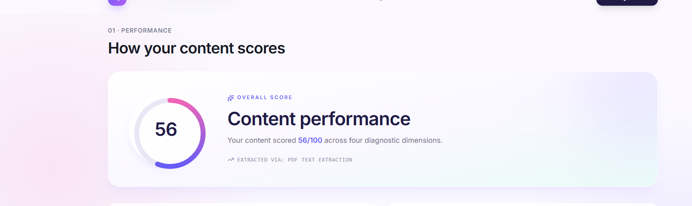
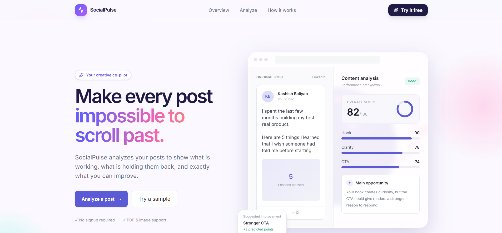
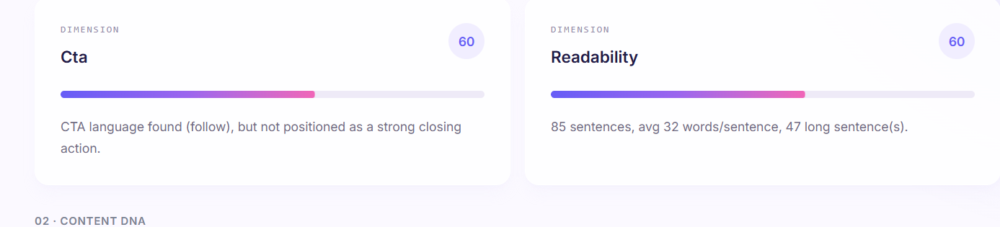
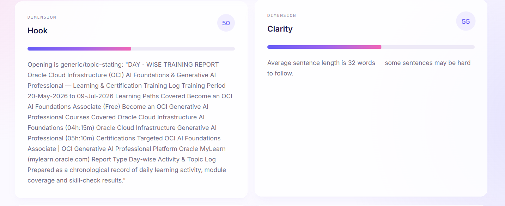
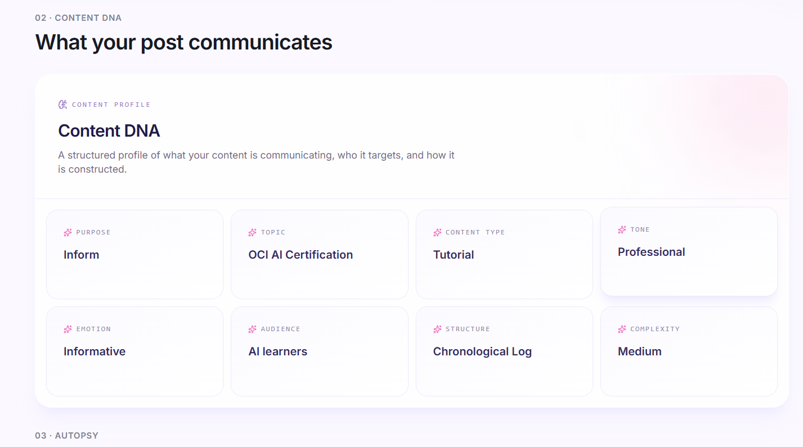
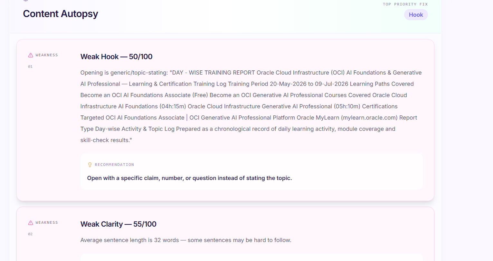
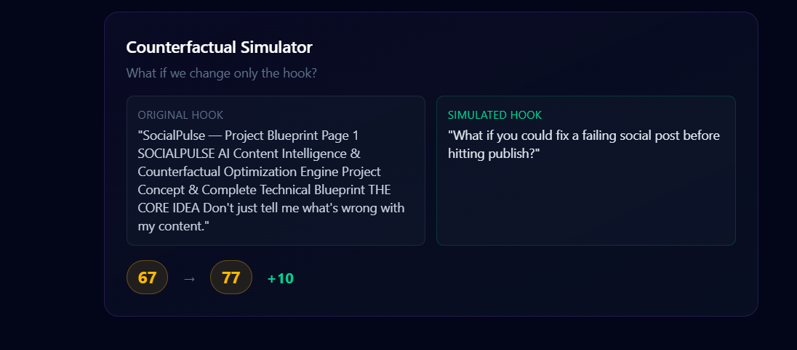

# SocialPulse

AI-powered Social Media Content Analyzer that evaluates content quality,
identifies weaknesses, extracts Content DNA, and simulates improved hooks.

## Live Demo

https://social-pulse-silk-six.vercel.app

## Backend API

https://socialpulse-o0z8.onrender.com

### API Documentation

https://socialpulse-o0z8.onrender.com/docs

Create a key at https://aistudio.google.com/apikey

Set `GEMINI_API_KEY` in `backend/.env`.

### Run the backend
```bash
uvicorn main:app --reload
```
Backend runs at `http://127.0.0.1:8000` (docs at `/docs`).

### Frontend
```bash
cd frontend
npm install
npm run dev
```
Frontend runs at `http://localhost:5173`.

## Key Features

- PDF and PNG/JPG content upload
- PDF text extraction using PyMuPDF
- OCR for images and scanned PDFs using Tesseract
- Content quality scoring
- Content Autopsy with actionable recommendations
- Content DNA classification using Gemini
- Counterfactual Hook Simulator
- Responsive React interface
- FastAPI backend with structured error handling

## API Endpoints

| Method | Endpoint | Purpose |
|---|---|---|
| POST | `/api/upload` | Upload PDF/image, extract text, score, and run autopsy |
| POST | `/api/simulate` | Regenerate the hook and return before/after comparison |

## Tech Stack

### Frontend
- React
- TypeScript
- Vite
- Tailwind CSS

### Backend
- Python
- FastAPI
- PyMuPDF
- Tesseract OCR

### AI
- Gemini API

### Deployment

- Vercel — Frontend
- Render — Backend

## Sample Data

Two example files are included in `sample_data/` for quick testing:
- `weak_post_example.png` — a generic, low-scoring post (good for seeing the full Autopsy + Simulator flow)
- `strong_post_example.png` — a stronger post for contrast

## Demo Flow

1. Upload `sample_data/weak_post_example.png`
2. Review the overall score and per-dimension breakdown
3. Read the Content Autopsy findings
4. Review the Content DNA classification
5. Click "Simulate Better Hook" and observe the score improvement

## Architecture

```text
React + TypeScript (Vercel)
            |
            v
FastAPI Backend (Render)
            |
            v
     PDF / Image Processing
            |
       +----+----+
       |         |
    PyMuPDF   Tesseract
       |         |
       +----+----+
            |
            v
      Extracted Text
            |
    +-------+-------+-------+
    |       |       |       |
    v       v       v       v
 Scoring  Autopsy  DNA   Simulator
    |       |       |       |
    +-------+-------+-------+
            |
            v
    Content Intelligence
         Dashboard
```

## Screenshots

**Content Performance**



**Content Intelligence Dashboard**



**Readability**



**Hook**



**Content DNA**



**Content Autopsy**



**Counterfactual Simulator**



## Limitations & Honesty Note

The "Content Score" is a measure under this project's own defined scoring framework — it is **not** a prediction of real engagement, likes, or virality. A future version could calibrate against real historical engagement data.

## Future Vision

Not implemented in this MVP, but designed for and documented here as a roadmap:
- A/B Lab (compare two full content versions side by side)
- Audience Simulator (score against different target audiences)
- Platform Optimizer (platform-specific rewriting for LinkedIn/X/Instagram)
- Content history and analytics (PostgreSQL)
- Privacy masking for sensitive uploaded content
- Calibrated engagement prediction using real historical data

## Approach Write-Up (200 words)

I noticed most AI content tools give a single static recommendation — "improve your hook" — without explaining why, or showing what the improvement would actually look like. I built SocialPulse to close that gap: it extracts content from PDFs and images (with OCR fallback for scanned documents), scores it across four measurable, rule-based dimensions, and explains each finding with specific evidence rather than a vague verdict.

The signature feature is the Counterfactual Simulator. Instead of a static suggestion, the user can trigger a controlled experiment: only the hook is regenerated, everything else in the content stays fixed, and the modified version is re-scored through the identical scoring pipeline used for the original. This makes the before/after comparison technically defensible rather than just "AI says it's better."

I deliberately kept the scoring engine deterministic rather than LLM-based, so results are consistent and explainable, and reserved the LLM for the one place it adds genuine value — generating a creative hook rewrite. Given the assessment's time constraint, I scoped the MVP around this one complete, working loop rather than building ten partial features, and documented the rest of the original product vision as a roadmap.
